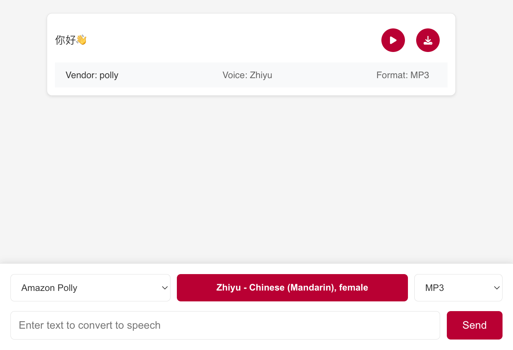

# TTS App

## Overview
The Text-to-Speech App (TTS App) is a web application that converts text into speech using various voice vendors like Amazon Polly and Microsoft Azure. The app allows users to select different voices, languages, and audio formats to generate speech from text input.

## Screenshot


## Voice Vendors
- [Amazon Polly](https://aws.amazon.com/polly/)
- [Microsoft Azure](https://azure.microsoft.com/en-us/services/cognitive-services/text-to-speech/)

## Features
- Convert text to speech using multiple voice vendors
- Select from a variety of voices and languages
- Choose audio formats (mp3, wav)
- Play and download generated audio

## Installation
1. Clone the repository:
   ```bash
   git clone https://github.com/hansonrobotics/tts-app.git
   ```
2. Navigate to the project directory:
   ```bash
   cd tts-app
   ```
3. Install dependencies:
   ```bash
   npm install
   ```

## Usage
1. Start the development server:
   ```bash
   npm start
   ```
2. Open your browser and navigate to `http://localhost:3000`.

## License
This project is licensed under the GNU General Public License v3.0 - see the [LICENSE](LICENSE) file for details.
